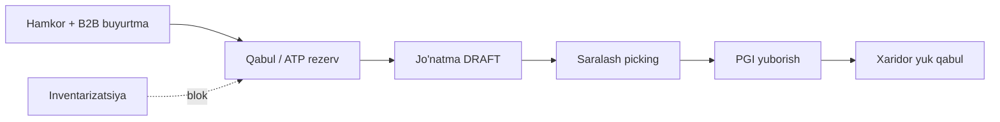

# Tadbirkor (Axis ERP): Ombor, B2B va jarayon — to‘liq qo‘llanma

> **Maqsad:** SAP uslubidagi oqim, inventarizatsiya, kirim/chiqim mas’uliyati, skaner va tizimdagi cheklovlar bo‘yicha jamoaga va foydalanuvchilarga bitta manba.  
> **Sana:** 2026-06 (suhbat asosida yig‘ilgan).  
> **Eslatma:** Ba’zi UI/API tuzatishlar kiritilgan; productionda API qayta ishga tushirilgan bo‘lishi kerak.

---

## Mundarija

1. [Umumiy B2B zanjir (SAP mantiqida)](#1-umumiy-b2b-zanjir-sap-mantiqida)
2. [Rollar: kim nima qiladi](#2-rollar-kim-nima-qiladi)
3. [Saralash (picking) va PGI](#3-saralash-picking-va-pgi)
4. [Qisman jo‘natma (masalan 7 + 3)](#4-qisman-jo‘natma-masalan-7--3)
5. [Yuk qabul va mahsulot mapping](#5-yuk-qabul-va-mahsulot-mapping)
6. [Inventarizatsiya](#6-inventarizatsiya)
7. [Ko‘p ombor bo‘lganda inventarizatsiya](#7-koʻp-ombor-boʻlganda-inventarizatsiya)
8. [ATP va zaxira holati](#8-atp-va-zaxira-holati)
9. [Kirim mas’uliyati: B2B vs ishlab chiqarish](#9-kirim-masuliyati-b2b-vs-ishlab-chiqarish)
10. [Skaner: chiqish, sanash va kelajakdagi kirim](#10-skaner-chiqish-sanash-va-kelajakdagi-kirim)
11. [Ikki turdagi shtrix-kod](#11-ikki-turdagi-shtrix-kod)
12. [Hozir shart bo‘lmagan SAP funksiyalar](#12-hozir-shart-boʻlmagan-sap-funksiyalar)
13. [Ma’lum texnik tuzatishlar (qisqa)](#13-malum-texnik-tuzatishlar-qisqa)
14. [Tekshirish ro‘yxati (test)](#14-tekshirish-roʻyxati-test)

---

## 1. Umumiy B2B zanjir (SAP mantiqida)

Asosiy zanjir **avval ham bor edi**; eng ko‘rinadigan qo‘shimcha — **saralash (picking)** va **PGI alohida bosqich**.



| Bosqich | Nima qiladi | SAP dagi o‘xshashi |
|--------|-------------|-------------------|
| B2B buyurtma | Hamkor buyurtma beradi | Sales order |
| Qabul (accept) | Sotuvchi qabul qiladi, **ATP rezerv** | ATP / reservation |
| Jo‘natma | Qisman ham mumkin, ombor tanlanadi | Outbound delivery |
| **Saralash** | Ombordan yig‘ish, skaner, `COMPLETED` | Picking |
| **PGI** | «Yukni yuborish» — chiqim, rezerv yechiladi, xaridorga kelgan yuk hujjati | Post Goods Issue |
| Yuk qabul | Xaridor qabul qiladi, omborga **kirim**, mapping | Goods receipt |

**Avval:** ko‘pincha jo‘natma → to‘g‘ridan-to‘g‘ri yuborish/qabul.  
**Hozir:** jo‘natma → **majburiy saralash** → keyin PGI.

**Inventarizatsiya** — alohida jarayon: qoldiq sanash/tuzatish; B2B zanjir emas, lekin sanash paytida shu ombordan operatsiyalar vaqtincha to‘silishi mumkin.

---

## 2. Rollar: kim nima qiladi

| Rol | Asosiy vazifalar |
|-----|------------------|
| **Sotuvchi** (OWNER/MANAGER/SALES) | Buyurtmani qabul qilish, jo‘natma yaratish, «Jo‘natiladi» miqdorini belgilash |
| **Ombor** (WAREHOUSE) | Saralash, skaner, vazifani tugatish |
| **PGI** | Ko‘pincha MANAGER/OWNER (`dispatches.send`) — «Yukni yuborish (PGI)» |
| **Xaridor** | «Kelgan yuklar» → yuk qabul, mapping (kerak bo‘lsa) |

---

## 3. Saralash (picking) va PGI

### Oqim

1. Buyurtma qabul qilingan → rezerv (ATP).
2. **Jo‘natma modali** — ombor, har qator uchun **Jo‘natiladi** miqdori.
3. **«Saralashga o‘tish»** — DRAFT jo‘natma + pick tasklar yaratiladi.
4. **Picking** — har mahsulot: skaner yoki miqdor, `COMPLETED`.
5. Barcha vazifalar tugagach — **«Yukni yuborish (PGI)»**.
6. PGI dan keyin jo‘natma `SENT`; xaridorda **Kelgan yuklar**.

### PGI dan keyin UI

- Tugma faqat `DRAFT` + barcha vazifalar `COMPLETED` bo‘lsa chiqadi.
- PGI muvaffaqiyatli bo‘lgach: holat **«Yuborilgan»**, tugma yo‘qoladi, qisqa vaqtdan keyin saralash ro‘yxatiga yo‘naltirish (dublikat PGI oldini olish).

### Skaner (chiqish)

- Pick task sahifasida: barkod/SKU solishtiriladi, `quantity` bilan +1 yoki ko‘proq.
- Noto‘g‘ri mahsulot skanerlanganda xato.

---

## 4. Qisman jo‘natma (masalan 7 + 3)

**To‘g‘ri usul:** jo‘natma modali ochilganda **Jo‘natiladi = 7** qilib «Saralashga o‘tish», keyin picking 7 ta, PGI.

**Noto‘g‘ri:** 10 qoldirib saralash → 7 ta yig‘ilsa PGI tugmasi chiqmasligi mumkin (barcha task `COMPLETED` bo‘lishi kerak).

**Qolgan 3:** yangi jo‘natma (yoki DRAFT qayta yaratish) — **Jo‘natiladi = 3**.

---

## 5. Yuk qabul va mahsulot mapping

### Xaridor tomonda

- **Kelgan yuklar** → qabul → tanlangan omborga **avtomatik kirim (IN)**.
- Birinchi qabulda katalog/mapping yaratilishi mumkin; keyingi qabulda **mavjud** variant + mapping ishlatiladi.

### UI «YANGI» vs haqiqat

- Ba’zan modaldа **「YANGI (avtomatik)」** ko‘rinib, ombor baribir **mavjud** variantga kirgan (SKU bo‘yicha backend to‘g‘ri topadi).
- Tuzatish: qabul modali (`mode=full`) uchun to‘liq preview — SKU bo‘yicha mavjud variant ham **「Mavjud」** deb ko‘rsatiladi.

### Qo‘lda mapping

- **B2B → Mahsulot mapping** — sotuvchi variantini xaridor variantiga bog‘lash (ixtiyoriy, lekin aniqroq).

---

## 6. Inventarizatsiya

> **Production:** POST 503, sekinlik, ko‘p foydalanuvchi — [PRODUCTION-MUAMMOLAR-VA-YECHIMLAR.md](./PRODUCTION-MUAMMOLAR-VA-YECHIMLAR.md).

**Vazifa:** kitobdagi qoldiq ≠ polkadagi qoldiq → sanash, tasdiq, tuzatish.

1. **Boshlash** — ombor tanlanadi, qoldiq qatorlari ro‘yxatga olinadi.
2. **Blok** — `blockedQuantity` oshadi; ATP da erkin qoldiq kamayadi.
3. **Sanash** — haqiqiy son; farq bo‘lsa manager tasdiqlaydi.
4. **Yakunlash** — farq bo‘yicha ADJUSTMENT (kirim/chiqim), bloklar yechiladi.
5. **Bekor** — blok yechiladi, qoldiq o‘zgarmasdan qolishi mumkin.

**B2B qabul / jo‘natma** shu omborda inventarizatsiya ochiq bo‘lsa — «inventarizatsiya bloki» xabari chiqishi mumkin.

---

## 7. Ko‘p ombor bo‘lganda inventarizatsiya

| Qoida | Tushuntirish |
|-------|--------------|
| **Har hujjat = 1 ombor** | «Yangi sanash» da bitta ombor tanlanadi |
| **Blok faqat shu omborda** | Boshqa omborlar normal ishlaydi |
| **Bir omborda 1 aktiv hujjat** | `Jarayonda` / `Tasdiqlash kutilmoqda` |
| **Turli omborlarda parallel** | Mumkin (Asosiy + Filial alohida) |
| **Bir mahsulot 2 omborda** | Har biri alohida `stockBalance`; sanash faqat tanlangan omborni tegaydi |

**Tavsiya:** katta sanashni ombor bo‘yicha rejalashtiring; jo‘natma ko‘p ketadigan omborni tinch vaqtda sanang.

---

## 8. ATP va zaxira holati

- **Jami** = onHand  
- **Rezerv** = buyurtma uchun band  
- **Blok** = inventarizatsiya  
- **Erkin** ≈ Jami − Rezerv − Blok  

Jo‘natma modali: qabul qilingan buyurtmada **dispatchable** = erkin + shu buyurtma rezervi (faqta `erkin >= qty` emas).

**Zaxira holati (ATP)** sahifasi — monitoring.

---

## 9. Kirim mas’uliyati: B2B vs ishlab chiqarish

### Biznes qoida (tavsiya etiladi)

| Manba | Kim | Qachon | Tizim |
|-------|-----|--------|-------|
| **B2B yuk qabul** | Xaridor | Hamkordan kelgan yuk tasdiqlanganda | **Avtomatik kirim** — alohida «ombor kirgazish» shart emas |
| **Ishlab chiqarish / birinchi to‘ldirish** | Ishlab chiqaruvchi | Yangi mahsulot yoki platformada birinchi marta ombor | **Qo‘lda kirim**, Excel, mahsulot kartochkasi |

```text
ISHLAB CHIQARUVCHI (birinchi marta / yangi SKU)
  → Mahsulot / Excel → boshlang‘ich qoldiq

B2B SOTUVCHI
  → Buyurtma → saralash → PGI (ombordan CHIQIM)
  → Xaridor qabul qiladi (uning omborida KIRIM — siz kiritmaysiz)

B2B XARIDOR
  → Kelgan yuklar → qabul (avtomatik KIRIM)
```

### «Ishlab chiqarish rejimi» (ombor sozlamasi)

- Omborda **«Umumiy zaxira» o‘chirilgan** → jo‘natmada zaxira tekshiruvi majburiy emas (buyurtma bo‘yicha ish).
- Bu **skanerli ishlab chiqarish kirimi** emas; yangi mahsulot qoldig‘i hali qo‘lda/Excel orqali.

### Tizim cheklovi

Hozir **tez kirim** barcha ruxsatli rollar uchun ochiq — bu **tashkiliy** qoida (faqat ishlab chiqarish kiritsin) hali kodda majburiy emas. Kelajakda rol yoki alohida ekran bilan mustahkamlash mumkin.

---

## 10. Skaner: chiqish, sanash va kelajakdagi kirim

| Jarayon | Skaner | Holat |
|---------|--------|-------|
| Saralash (chiqish) | Ha | Bor |
| Inventarizatsiya (sanash) | Ha | Bor |
| **Ombor kirim (qabul)** | **Yo‘q** | Qo‘lda, Excel, B2B qabul |
| B2B yuk qabul | Yo‘q | Buyurtma qatorlari bo‘yicha |

---

## 11. Ikki turdagi shtrix-kod

### 1-tur: Oddiy (bir xil barcode)

**Misol:** 10 ta bir xil Coca-Cola, kurtka bir rusum.

- Barcha donada **bir xil** SKU/barcode.
- Skaner → mahsulot **turi** aniqlanadi → miqdor +1 yoki bir skaner + `10`.
- **Tizimga oson mos** — picking bilan bir xil mantiq, faqat yo‘nalish **kirim**.

```
Skaner → mahsulot topildi → +miqdor → tasdiq → ombor +N
```

### 2-tur: Seriya (har dona boshqacha)

**Misol:** telefon (IMEI), qimmat uskuna, dori.

- Har dona **takrorlanmas** serial / Data Matrix.
- 10 dona = 10 xil kod; takror skaner → xato.
- **Hozir tizimda serial jadvali yo‘q** — alohida loyiha (`StockSerial` va hokazo).
- Kiyim / oddiy B2B uchun odatda **keyinroq yoki shart emas**.

```
Har skaner → IMEI qo‘shiladi → 10 ta yig‘iladi → ombor +10 (ichida 10 serial)
```

### Qachon skanerli kirim kerak?

| Maqsad | Hozir | Skaner |
|--------|-------|--------|
| B2B kelgan yuk | Kelgan yuklar → qabul | Kam kerak |
| Yetkazuvchi / ishlab chiqarish kirim | Tez kirim / Excel | 1-tur foydali |
| Ombor sanash | Inventarizatsiya | Bor (sanash) |
| Jo‘natma chiqarish | Saralash | Bor |

---

## 12. Hozir shart bo‘lmagan SAP funksiyalar

| Funksiya | Kerak bo‘ladimi? | Izoh |
|----------|------------------|------|
| **Bin/lokatsiya bo‘yicha chuqur picking** | Odatda **yo‘q** | Katta ombor, ko‘p xodim, zona/stelaj bo‘lsa keyinroq |
| **To‘liq RECOUNTING** | Odatda **yo‘q** | Qattiq audit, mustaqil qayta-sana qoidalari bo‘lsa |
| **Barcha hujjatlar bitta ekranda** | **Yo‘q** (qulaylik) | Rollar bo‘yicha alohida ekranlar xavfsizroq |

**Hozir e’tibor:** mavjud zanjirni barqaror ishlatish, xodimlarni rollar bo‘yicha o‘rgatish.

---

## 13. Ma’lum texnik tuzatishlar (qisqa)

| Muammo | Sabab | Yechim (qisqa) |
|--------|-------|----------------|
| Qabul modali «YANGI», ombor to‘g‘ri | Preview `lite` rejim | `mode=full` + SKU preview |
| PGI tugmasi qoladi | UI holatni yangilamagan | `SENT` → tugma yo‘q, yo‘naltirish |
| P2028 «bazasi band» | Qisqa tranzaksiya, PickTask oxirida | Uzoq timeout, pick task tranzaksiyadan keyin |
| Ovoz chiqmaydi | Faqat `Notification` API | Web Audio signal + toast `silent` |
| Debug «Zaxira to‘ldirish» | Test tugmasi | Olib tashlangan |

---

## 14. Tekshirish ro‘yxati (test)

- [ ] Hamkor ulanishi → buyurtma → qabul (rezerv)
- [ ] Jo‘natma: **Jo‘natiladi** to‘g‘ri (qisman 7+3)
- [ ] Saralash → barcha `COMPLETED` → PGI → holat `SENT`, tugma yo‘qoladi
- [ ] Xaridor: kelgan yuk → qabul → ombor + mapping «Mavjud»
- [ ] Inventarizatsiya: faqat tanlangan ombor blok; boshqa ombor ishlaydi
- [ ] Inventarizatsiya tugagach B2B qayta ishlaydi
- [ ] Bildirishnoma: ovoz sinovi (birinchi marta ekranga bosish)

---

## Qisqa xulosa

1. **B2B** — buyurtma → rezerv → jo‘natma → **saralash** → **PGI** → xaridor **qabul** (avtomatik kirim).  
2. **Inventarizatsiya** — ombor bo‘yicha sanash/blok; B2B dan alohida.  
3. **Qo‘lda kirim** — asosan yangi mahsulot va birinchi ombor; B2B qabul alohida emas.  
4. **Skaner kirim** — hali yo‘q; 1-tur barcode keyingi qadam; 2-tur serial — keyinroq.  
5. **Bin / RECOUNTING / bir ekran** — hozir shart emas.

---

*Hujjat yangilanganda: `docs/` papkasida versiya sanasini qo‘shing yoki git tarixiga qarang.*
