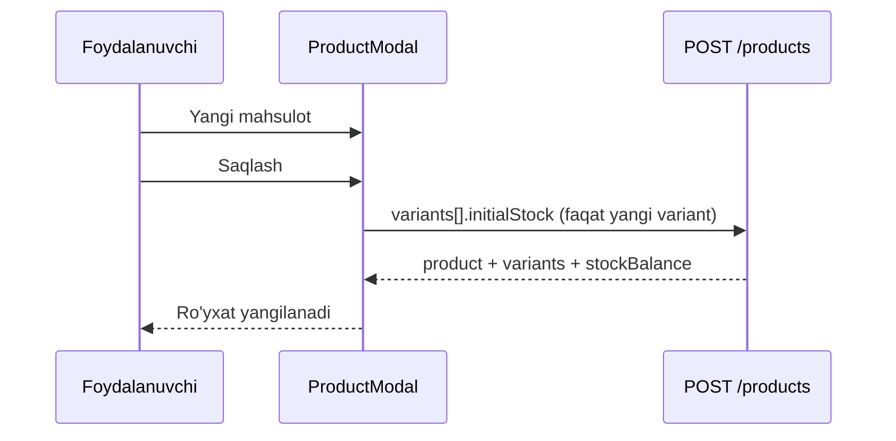
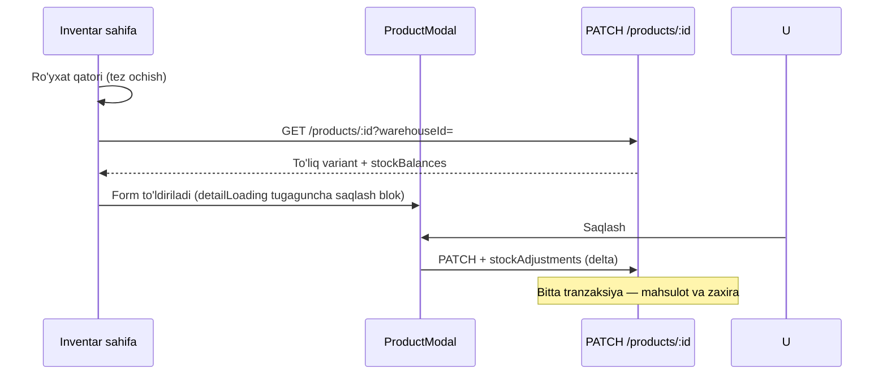

# Mahsulot saqlash va kirish oqimi (kanonik)

> **Maqsad:** Inventar, modal va Excel import bir xil qoidalarga amal qilsin — “saqladim, lekin omborda yo‘q” holati takrorlanmasin.  
> **Oxirgi yangilanish:** 2026-05-29

---

## 1. Asosiy model (o‘zgarmas qoida)

```text
Product (katalog kartochkasi)
  └── ProductVariant (sotiladigan birlik, SKU/barcode)
        └── StockBalance (omborda qoldiq — faqat variant + warehouse)
              └── StockMovement (har bir kirim/chiqim tarixi)
```

| Qatlam | Kim yozadi | Qayerda |
|--------|------------|---------|
| Mahsulot nomi, kategoriya, birlik | `PATCH/POST /products` | `products.service` |
| Variant, narx, SKU | `PATCH/POST /products` (variants[]) | bir tranzaksiya |
| **Yangi** variant boshlang‘ich zaxira | `initialStock` + `warehouseId` | product TX (`PRODUCT_INITIAL`) |
| **Mavjud** variant zaxira o‘zgarishi | `stockAdjustments[]` | product TX (`ADJUSTMENT`) |
| Excel import zaxira | import row TX | `product-import.service` |
| Qo‘lda tuzatish (alohida ekran) | `POST /stock/adjustments` | `stock.service` |

---

## 2. UI oqimlari (Inventar)

### 2.1 Yangi mahsulot



**Majburiy:** kategoriya, kamida 1 variant, tanlangan ombor (zaxira ustuni ko‘rinsa).

### 2.2 Tezkor kirim / chiqim (mavjud mahsulot)

**UI:** Inventar → **Tezkor kirim** yoki qatoridagi ↗ tugmasi → `QuickStockModal`.

| Qadam | Maydon |
|-------|--------|
| 1 | Mahsulot qidirish (nom / SKU / barkod) |
| 2 | Variant (ko‘p bo‘lsa) |
| 3 | Miqdor + ixtiyoriy izoh |
| 4 | **Kirimni tasdiqlash** |

**API:** `POST /stock/movements/in` yoki `/out` — to‘liq `ProductModal` ochilmaydi.

### 2.3 Tahrirlash (ochish + saqlash)



**Oldin (xavfli):** PATCH muvaffaqiyatli, keyin alohida `/stock/adjustments` — yarim holat.  
**Hozir:** `stockAdjustments` PATCH ichida.

### 2.4 O‘chirish

| Holat | Natija |
|-------|--------|
| Tarix yo‘q (harakat, buyurtma, …) | Hard delete |
| Tarix bor | `ARCHIVED` — SKU bazada qoladi |
| Qayta Excel/import | Arxiv SKU topilsa → **qayta ACTIVE** + zaxira |

---

## 3. Excel kirim oqimi

| Bosqich | API | Eslatma |
|---------|-----|---------|
| Preview | `POST /products/import/preview?warehouseId=&importMode=` | `stockPolicy: apply_all`; arxiv SKU qayta ochiladi |
| Tasdiqlash | `POST /products/import/confirm` | `confirmable` qatorlar (skip + zaxira > 0 ham) |
| Zaxira ustuni | **Kirim / Qoldiq** (I yoki sarlavha bo‘yicha) | `kirim`, `miqdor`, `qoldiq` sinonimlari |
| Rejim | default **`add`** (kirim) | `set` = almashtirish; `subtract` = ayirish |
| Kategoriya yo‘q | `Umumiy` yaratiladi | Excelda kategoriya shart emas |

**Preview statistikasi:** `confirmable` (tasdiqlash), `stockApplyCount` (kirim yoziladi).

**Frontend:** `ImportProductModal` — zaxira ustuni yo‘q bo‘lsa ogohlantirish; tugma «Kirimni tasdiqlash».

---

## 4. Cache va realtime

| Hodisa | Harakat |
|--------|---------|
| Modal saqlash | `invalidateQueries(['products'])` + zaxira bo‘lsa stock-balances |
| Modal ochiq | Realtime **o‘chirilgan** (1200ms debounce qayta yoqiladi) |
| Import tugashi | `['products']` invalidate |

---

## 5. Tez-tez xatolar va sabab

| Belgisi | Sabab | Yechim |
|---------|-------|--------|
| Saqladim, ro‘yxatda zaxira 0 | PATCH bo‘ldi, stock adjust yiqildi (eski versiya) | Yangi API: `stockAdjustments` |
| SKU band | Arxivlangan mahsulot | Import/qayta import — reactivate |
| Preview skip, import bo‘lmadi | Frontend skip filtri | `hasImportableStock` |
| Tahrirda noto‘g‘ri qoldiq | Modal ro‘yxat qatori bilan ochildi | `GET /products/:id?warehouseId` kutish |
| Test kompaniya iflos | Eski sinovlar | Yangi kompaniya yoki SQL tozalash |

---

## 6. Kod manbalari

| Vazifa | Fayl |
|--------|------|
| Tezkor kirim | `apps/web/src/features/inventory/components/QuickStockModal.tsx` |
| Modal saqlash | `apps/web/src/features/product-modal/ProductModal.tsx` |
| Inventar ochish | `apps/web/src/app/dashboard/inventory/page.tsx` |
| Product create/update | `apps/api/src/modules/products/products.service.ts` |
| DTO stockAdjustments | `apps/api/src/modules/products/dto/product.dto.ts` |
| Excel import | `apps/api/src/modules/products/product-import.service.ts` |
| Alohida tuzatish | `apps/api/src/modules/warehouses/stock.service.ts` |

---

## 7. Kelajakdagi qoidalar (jamoa uchun)

1. **Mahsulot modalidan zaxira** — faqat `PATCH` orqali (`stockAdjustments`), alohida `adjust` chaqirmang.  
2. **Yangi funksiya** — avval yangi kompaniyada 1 to‘liq oqim, keyin production.  
3. **O‘zgarish** — shu fayl + `CHANGELOG.md` yangilansin.  
4. **`/product-variants` REST** — modal ishlatmaydi; yangi UI ham `PATCH /products` dan foydalansin.
